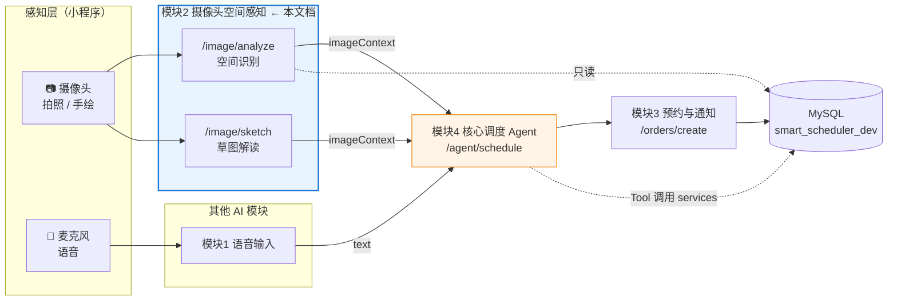
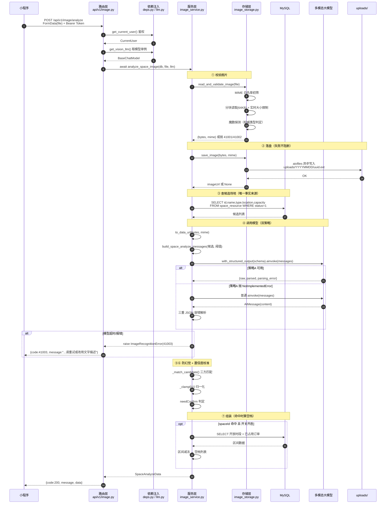
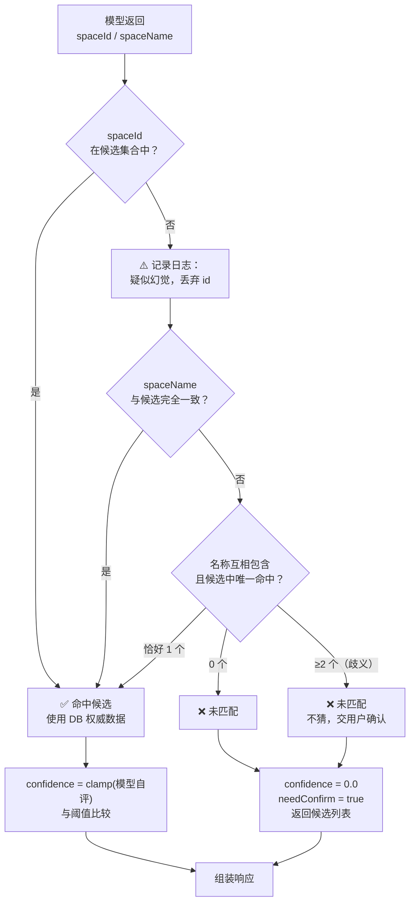
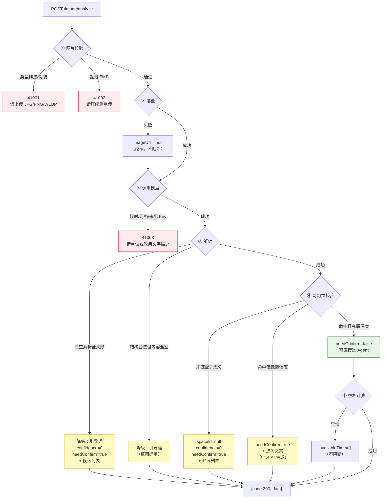
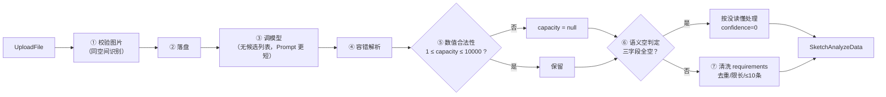
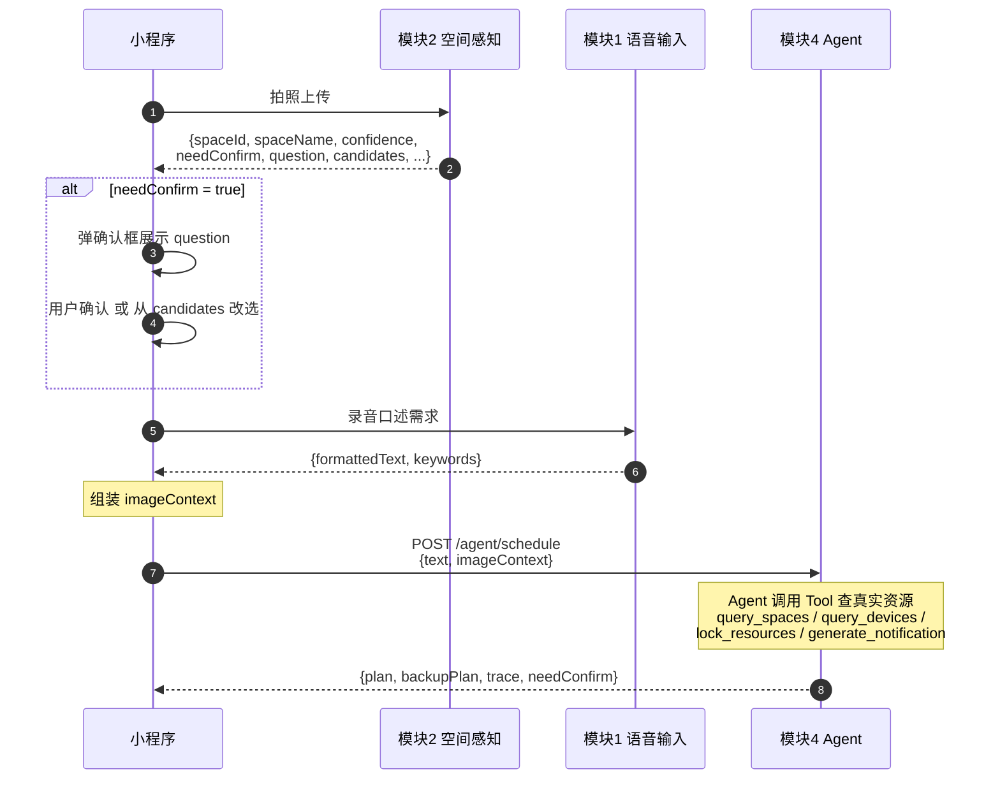
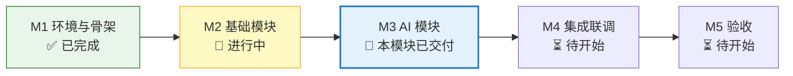
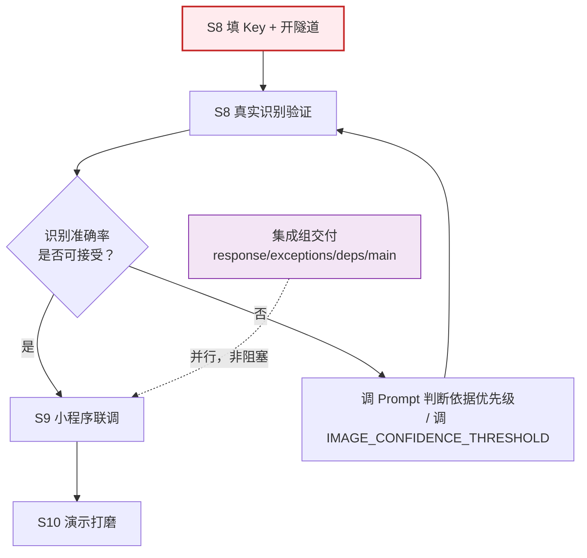

# 摄像头空间感知模块 —— 接口数据流转图 & 开发路线图

> 配套文档：`docs/摄像头空间感知模块设计.md`（设计与决策依据）
> 对应 `开发流程.md`：§4.4 模块 2、§5.3 模块 2 接口契约、§15.1 演示主线一

---

# 第一部分：接口数据流转

## 一、模块在全系统中的位置



**关键边界**：本模块只**读**数据库，把结果交给 Agent。**它不写任何一张表**，也不产生预约订单。

---

## 二、本模块对外接口清单

| 接口 | 方法 | 入口 | 产物 | 消费方 |
| --- | --- | --- | --- | --- |
| `/api/v1/image/analyze` | POST | FormData(`file`) | `SpaceAnalyzeData` | 小程序 UI + 模块 4 |
| `/api/v1/image/sketch` | POST | FormData(`file`) | `SketchAnalyzeData` | 小程序 UI + 模块 4 |
| `/api/v1/health` | GET | —— | 服务状态 | 部署探活 / 联调自检 |

**内部（非 HTTP 端点）**：本模块**没有**定义任何 LangChain Tool。§5.3 列出的 Tool（`query_spaces` 等）属于模块 4。
本模块的服务层函数（`analyze_space_image` 等）直接由路由调用，不经 Tool 层。

---

## 三、端到端时序图（空间识别）



### ASCII 版（便于终端阅读）

```
小程序 ──POST FormData(file)──► 路由层 ──Depends──► 鉴权 / 模型单例
                                  │
                                  ▼
                     ┌────────────────────────┐
                     │ ① 校验图片              │ 失败 ──► 41001 / 41002
                     │   MIME → 分块读 → 魔数  │
                     ├────────────────────────┤
                     │ ② 落盘（失败不阻断）    │ 失败 ──► imageUrl=null
                     ├────────────────────────┤
                     │ ③ 查候选场地            │◄──── space_resource
                     ├────────────────────────┤
                     │ ④ 调模型（双策略）      │ 失败 ──► 41003
                     │   策略A: 结构化输出     │
                     │   策略B: 手工解析       │
                     ├────────────────────────┤
                     │ ⑤ 容错解析              │ 失败 ──► 降级引导语 + 候选
                     ├────────────────────────┤
                     │ ⑥ 防幻觉 + 置信度校准   │ 幻觉 ──► spaceId=null
                     ├────────────────────────┤
                     │ ⑦ 组装（空档可选）      │◄──── reserve_order
                     └────────────────────────┘
                                  │
                                  ▼
                       {code:200, data:{...}}
```

---

## 四、数据形态变换表

数据在每一层的形态，是排查问题时最有用的对照表：

| 阶段 | 数据形态 | 关键字段 / 类型 | 说明 |
| --- | --- | --- | --- |
| HTTP 入参 | `UploadFile` | `filename` / `content_type` / 异步流 | 客户端声明不可信 |
| ① 校验后 | `bytes` + `str` | `b"\xff\xd8\xff..."` + `"image/jpeg"` | **mime 以魔数为准**，非声明值 |
| ② 落盘后 | `str \| None` | `/uploads/20260925/9f3c....jpg` | 失败为 `None` |
| 模型入参 | `list[BaseMessage]` | `SystemMessage` + `HumanMessage(content=[文本块, 图片块])` | 图片为 base64 data URL |
| 模型出参（A） | `dict` | `{"raw": AIMessage, "parsed": SpaceRecognition \| None, "parsing_error": ...}` | `include_raw=True` 的产物 |
| 模型出参（B） | `AIMessage` | `.content` 可能是 `str` 或 `list[block]` | 需 `_normalize_message_text` 归一化 |
| 解析后 | `SpaceRecognition \| None` | Pydantic 对象，已过 before-validator | `None` 即降级 |
| 校验后 | `SpaceCandidate \| None` | 数据库里的权威记录 | 绝不采用模型输出的名称/容量 |
| 响应 `data` | `SpaceAnalyzeData` | camelCase 字段 | `model_dump()` 后进统一响应体 |
| HTTP 出参 | `dict` | `{"code", "message", "data"}` | §5.2 统一响应体 |

---

## 五、防幻觉：三方匹配决策树

这是本模块最核心的安全逻辑（代码位置：`image_service._match_candidate`）。



**要点**：

- 模型自评的 `0.99` 在"未匹配"时会**强制归零** —— 否则前端会显示"99% 置信度但没识别出场地"这种自相矛盾的结果。
- 歧义（多个候选同时匹配）时**不猜**，返回未匹配。与其赌一把，不如让用户点一下。

---

## 六、异常与降级分叉图



**核心原则**：只有**红色**三条（请求不合法 / AI 挂了）返回非 200 业务码；
其余黄色降级全部返回 `code=200` + 降级数据，保证前端流程不中断。

---

## 七、草图识别流程（差异部分）



**与空间识别的三点差异**：

1. **不查候选场地** —— 草图解读的是"需求"而非"身份"，没有对应的真实场地。
2. **不做数据库校验** —— 只做数值合法性校验（人数范围）。
3. **多一道语义空判定** —— 防止"结构合法但全空 + 高置信度"这种自相矛盾的结果。

---

## 八、模块间接口流转（本模块 → 模块 4）



### imageContext 字段建议（**需与 Agent 组确认**）

推荐**直接透传本模块的整个 `data`**，避免字段遗漏：

```json
{
  "text": "周五下午要个能坐40人的展厅，带双投影",
  "imageContext": {
    "type": "space",
    "spaceId": 4,
    "spaceName": "A栋3楼展厅",
    "confidence": 0.92,
    "needConfirm": false,
    "rawText": "A-3F 展厅",
    "devices": [{ "deviceType": "投影仪", "count": 1, "confidence": 0.0 }]
  }
}
```

**Agent 侧注意事项**：

- `imageContext.spaceId` 是**后端已校验过**的真实场地 id，Agent 可以直接使用，但仍应通过 `query_spaces` 二次确认可预约性（§5.5 事务与并发控制）。
- `needConfirm=true` 时，**不要**把 `spaceId` 当作确定答案 —— 它只是"最可能的猜测"，需要用户确认后才可信。

---

## 九、数据库使用情况

| 表 | 访问方式 | 用途 | 时机 |
| --- | --- | --- | --- |
| `space_resource` | **只读** | 查候选场地（`status=1`）、取开放时段 | 每次 analyze 请求 |
| `reserve_order` | **只读** | 算空档（`order_status in (1,2)`） | 命中场地且开关开启时 |
| 其他 7 张表 | **不访问** | —— | —— |

**本模块不写任何表。** 表结构变更由集成组统一执行（§6.5）。

---

# 第二部分：开发路线图

## 十、里程碑与当前进度



| 阶段 | 交付物 | 验收标准 | 状态 |
| --- | --- | --- | --- |
| M1 环境与骨架 | conda 环境、目录结构、数据库连接 | 本地能跑通空实现，库能连上 | ✅ 骨架已就绪 |
| M2 基础模块 | 用户认证、资源管理、预约订单 CRUD | 接口契约全部可调通 | 🔄 集成组进行中 |
| M3 AI 模块 | 语音、图像、Agent、巡检、通知、看板 | 各模块接口自测通过 | 🔄 **本模块（图像）已交付并通过 64 项单测** |
| M4 集成联调 | 前后端、小程序、Agent 全链路 | 双主线演示流程完整跑通 | ⏳ |
| M5 验收 | 部署文档、测试用例、演示脚本 | 云服务器可部署，双主线可复现 | ⏳ |

---

## 十一、本模块任务分解

| 阶段 | 内容 | 产出 | 依赖 | 状态 |
| --- | --- | --- | --- | --- |
| S0 | 与集成组 / Agent 组 / 小程序对齐（设计文档 §13 的 12 个问题） | 确认结论 | —— | ⏳ **待你推进** |
| S1 | 配置项 + `.env` / `.env.example` | 配置就绪 | S0 | ✅ |
| S2 | `schemas/image.py` + `core/llm.py` + `agent/prompts/image_prompt.py` | 骨架与 Prompt | S1 | ✅ |
| S3 | `services/image_storage.py`（魔数 / 路径穿越 / 大小限制） | 存储服务 | S2 | ✅ |
| S4 | `services/image_service.py`（双策略 / 防幻觉 / 降级 / 空档） | 核心服务 | S3 | ✅ |
| S5 | `api/v1/image.py` + `main.py` 装配 | 接口可调 | S4 | ✅ |
| S6 | `tests/` 全部用例 | 测试通过 | S5 | ✅ **64/64 通过** |
| S7 | `scripts/seed.py` + 数据流转文档 | 自助工具 | S6 | ✅（`check` 已跑通） |
| S8 | **填 `VISION_API_KEY` + 开 SSH 隧道 + 跑真实识别** | 端到端验证 | S7 | ⏳ **阻塞中** |
| S9 | 小程序真机联调（拍照、追问、改选） | 端到端跑通 | S8 | ⏳ |
| S10 | 演示脚本打磨（预置图片 + 阈值调优） | 屏 1 稳定 | S9 | ⏳ |

---

## 十二、关键路径与风险



| 风险 | 影响 | 应对 | 当前状态 |
| --- | --- | --- | --- |
| **`VISION_API_KEY` 未配置** | 真实识别完全跑不了 | 填 Key；在此之前用 `--mock` 验证流程 | 🔴 **当前阻塞项** |
| **SSH 隧道未开** | 数据库连不上，候选场地为空 | 开隧道；`seed.py check` 会给出具体命令 | 🔴 **当前阻塞项** |
| 模型不支持结构化输出 | 策略 A 报错 | 自动降级到策略 B，**功能不受影响**；或改 `VISION_STRUCTURED_OUTPUT=false` | 🟢 已兜底 |
| 模型识别准确率低 | 演示翻车 | 调 Prompt 判断依据优先级；调低阈值强制走追问分支；预置可稳定识别的照片 | 🟡 待实测 |
| 集成组临时文件被覆盖后签名不一致 | 模块 2 编译失败 | 契约已在设计文档 §2.2 固化，交付时对照检查 | 🟡 待对齐 |
| `.env` 已被提交进仓库 | **数据库密码 + JWT 密钥 + API Key 泄露** | 已补 `.gitignore`；**需执行 `git rm --cached backend/.env`** | 🔴 **待你处理** |

---

## 十三、联调检查清单

按顺序逐项打勾，任何一个 ❌ 都会导致后面的步骤失败：

```
□ 1. 填好 backend/.env 的 VISION_API_KEY
□ 2. 开 SSH 隧道：ssh -L 3308:127.0.0.1:3307 root@<服务器IP> -N
□ 3. python scripts/seed.py check        → 期望：全部 [OK]
□ 4. python scripts/seed.py seed         → 期望：场地 8 条 / 设备 5 条 / 预约 10 条
□ 5. python scripts/seed.py test --mock  → 期望：走通全流程，confidence=0.90，needConfirm=false
□ 6. python scripts/seed.py test --mock --confidence 0.6
                                         → 期望：needConfirm=true，有追问文案
□ 7. python scripts/seed.py test --image <真实场地照片>
                                         → 期望：spaceId 命中数据库真实场地
□ 8. uvicorn app.main:app --reload --host 0.0.0.0 --port 8000
□ 9. 浏览器打开 http://127.0.0.1:8000/docs
                                         → 期望：看到「摄像头空间感知」分组，两个接口
□ 10. 在 /docs 里上传一张场地照片点 Execute
                                         → 期望：返回结构完整的 data
□ 11. 确认返回空间 id 在数据库里真实存在（防幻觉底线）
□ 12. 小程序端真机跑通：拍照 → 识别 → 追问 → 确认 → 送 Agent
```

---

## 十四、演示当天的应急切换

| 现场故障 | 应急动作 | 具体操作 |
| --- | --- | --- |
| 模型 API 欠费/超时 | 切换假模型演示流程完整性 | `seed.py test --mock`，或把 `VISION_API_BASE` 指向本地假服务 |
| 识别置信度太高，没触发追问（少了一个演示亮点） | 临时调高阈值 | `.env` 改 `IMAGE_CONFIDENCE_THRESHOLD=0.95`，重启服务 |
| 云数据库断连 | 演示降级路径 | 候选场地为空 → 接口仍返回 200 + 引导语，**不会白屏** |
| 上传的图片超 5MB | 前端压缩 | 小程序 `chooseMedia` 加 `sizeType: ["compressed"]` |
| 网络完全不通 | 演示本地缓存的响应 | 提前录屏 / 截图兜底 |
